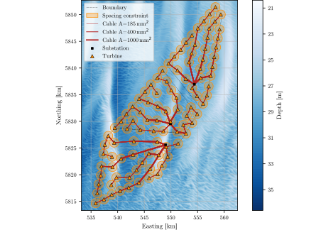

# The IEA Wind 2200-22-MW Reference Offshore Wind Plants

This repository contains the data and computational tools defining the **IEA Wind 2200-22-MW Reference Offshore Wind Plants**, encoded following the [windIO ontology](https://github.com/IEAWindSystems/windIO). The dataset, its structure, metadata, and the methodology used to generate and optimize the layouts are described in detail in the following *Wind Energy Science* data description article (a link to the preprint will be provided here once available):

> Kainz, S., Quick, J., Bay, C. J., Valotta Rodrigues, R., Arasteh, A., Souza de Alencar, M., Kapila, A., Réthoré, P.-E., Bortolotti, P., & Bottasso, C. L.: *The IEA Wind 2200-22-MW Reference Offshore Wind Plants*. Manuscript under preparation.

The reference plants comprise **three closely spaced wind plants with a total of 100 IEA Wind 22-MW turbines**, exhibiting strong internal and external wake interactions. These conditions reflect modern offshore wind developments, such as those in the North Sea. A **neighbor-aware, cost-based objective function** is used to determine the plant layouts.

  

  
<em>The three IEA Wind 2200-22-MW Reference Offshore Wind Plants.</em>

The dataset specifies the site, the three wind plants, the turbine locations, and the underlying wake-model assumptions. By following the standardized windIO ontology, the reference plants provide unambiguous, machine-readable, and machine-actionable definitions that can be consistently exchanged between different tools.

The dataset is **open-source and FAIR-compliant** and is intended to support benchmarking, method validation and comparison, and collaboration across academia, industry, and national laboratories, while avoiding the use of confidential or proprietary data.

Example scripts are provided to support the integration of the reference plants into common wind-plant flow simulation tools. The optimization routine used to generate the layouts is also provided, supporting **reproducibility and transparency**.

For more information, see:

- [`data/README.md`](data/README.md) — description of the data structure and files.
- [`scripts/README.md`](scripts/README.md) — description of the computational workflow and scripts.

## Usage

The reference plant data can be loaded using the [`windIO`](https://github.com/IEAWindSystems/windIO) Python package.

First, clone this repository or download it as a ZIP file. The reference plant data are located in the `data/` directory.

Create a clean Python environment and install `windIO`:

    pip install windIO

Then load the reference plant definition:

    import windIO
    system_dat = windIO.load_yaml("PATH_TO/wind_energy_system.yaml")

Replace `PATH_TO/wind_energy_system.yaml` with the path to the `wind_energy_system.yaml` file on your system.

The `system_dat` dictionary contains the complete reference plant definitions. The individual data can then be extracted and processed as needed.

Example scripts demonstrating how to load and use the reference plant data are provided in the [`scripts/`](scripts/) directory.

## Citation
If you use the IEA Wind 2200-22-MW Reference Offshore Wind Plants in a publication, presentation, software project, or other research activity, please cite the above-mentioned scientific publication:
> Kainz, S., Quick, J., Bay, C. J., Valotta Rodrigues, R., Arasteh, A., Souza de Alencar, M., Kapila, A., Réthoré, P.-E., Bortolotti, P., & Bottasso, C. L.: *The IEA Wind 2200-22-MW Reference Offshore Wind Plants*. Manuscript under preparation.

## Related repositories

- [IEA Wind 22-MW Reference Wind Turbine](https://github.com/IEAWindSystems/IEA-22-280-RWT)
- [windIO](https://github.com/IEAWindSystems/windIO)

## License

This repository is released under the [Apache License 2.0](LICENSE).

You are free to:

- Use the data for research, education, and commercial applications
- Copy and redistribute the data
- Modify the data and create derivative datasets
- Use the scripts, modify them, and include them in other projects
- Use the reference plants as inputs or benchmarks in your own software and publications

You do **not** need to ask the authors for permission to use the data.

If you redistribute the data or substantial parts of the repository, please retain the original copyright and license notices. If you modify the files, indicate that you have made changes. When publishing results based on the reference plants, please **cite the reference publication given above**.
