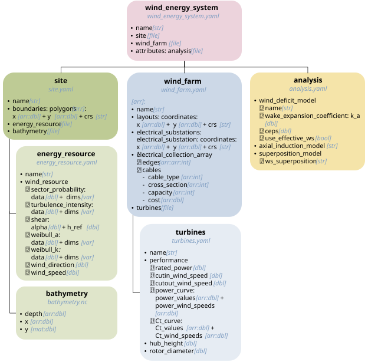

# Data

The `data/` directory contains the wind-energy-system definitions of the IEA Wind 2200-22-MW Reference Offshore Wind Plants, encoded following the [windIO ontology](https://github.com/IEAWindSystems/windIO).

The file structure and organization of the data are shown below.

The main wind_energy_system.yaml file provides the complete definition of the reference wind-energy system and serves as the top-level entry point to the dataset. It references the additional files containing the site, wind plants, turbine specifications, and other data required to define the reference plants.

For details on loading and using the data, see the [repository README](../README.md) and the example scripts in [`../scripts/`](../scripts/).
