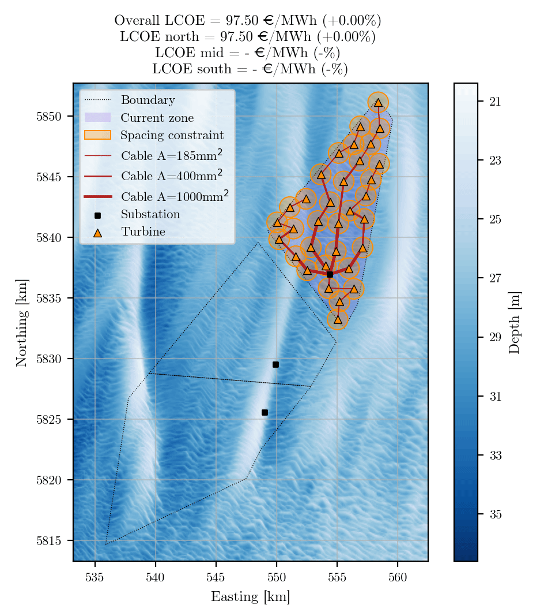

# Scripts

The `scripts/` directory contains five Python routines supporting the use, validation, and reproducibility of the IEA Wind 2200-22-MW Reference Offshore Wind Plants.

- **Optimization:** The optimization routine used to generate the reference plant layouts. The numerical assumptions used in the optimization are provided to support reproducibility and transparency.
- **PyWake example:** A simple application example showing how to load the reference plant data and run a wake simulation using [PyWake](https://gitlab.windenergy.dtu.dk/TOPFARM/PyWake).
- **FLORIS example:** An application example demonstrating how to use the reference plant data with [FLORIS](https://github.com/NatLabRockies/floris).
- **WIFA example:** An example demonstrating the machine-actionable use of the dataset by running a wind-farm flow simulation with PyWake through the [WIFA](https://github.com/EUFLOW/WIFA) pipeline. This example requires WIFA commit [`d1fc493`](https://github.com/EUFLOW/WIFA/commit/d1fc493b0a745df079840d31ef4127553467e997) or a later commit, as this functionality is not yet available in the latest stable release.
- **Validation:** The `validate.py` script validates that the data are correctly encoded according to the [windIO ontology](https://github.com/IEAWindSystems/windIO). This helps ensure consistency, interoperability, and correctness of the dataset. The validation script requires windIO commit [`97e0631`](https://github.com/IEAWindSystems/windIO/commit/97e0631d71ee13836e800fcad56d6e4e03be7218) or a later commit, as this functionality is not yet available in the latest stable release.

The scripts are provided as examples and can be adapted to specific workflows and simulation tools.

## Supporting files

The `subscripts/` directory contains additional input files and helper scripts required by the example routines.

The `Results/` directory contains the optimization results and associated post-processing. It includes:

- The recorded optimization history based on the sampled wind rose. The corresponding AEP and LCOE values are based on the sampled wind rose and therefore do not represent the final values.
- The post-processed optimization history evaluated using the full wind rose, providing the final AEP and LCOE values.
- A visualization of the layout optimization process.

### Optimization process

The following animation provides a preview of the layout optimization process:

[Watch the full-resolution optimization video](Results/Optimization.mp4)
